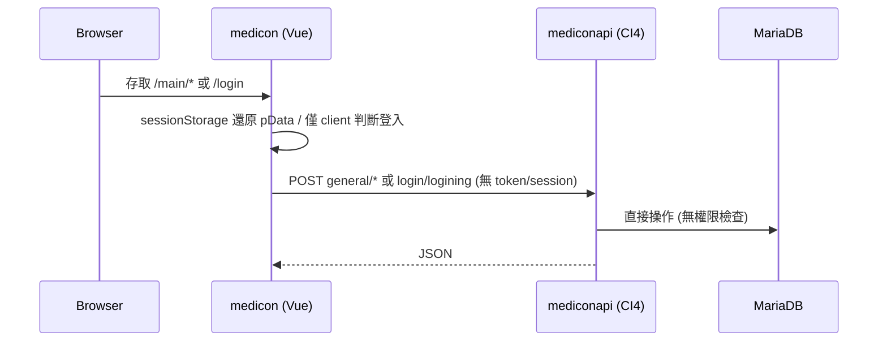

# Medicon 專案安全與改進審查計畫

## 一、架構與資料流概覽

- **前端**：Vue 3 + Pinia + Vite，API 透過 [src/assets/js/api.js](medicon/src/assets/js/api.js) 的 axios instance，baseURL 與 databaseName 來自 [src/stores/useStore.js](medicon/src/stores/useStore.js)。
- **後端**：CodeIgniter 4，`setAutoRoute(true)`，主要 API 在 [app/Controllers/General.php](mediconapi/app/Controllers/General.php)、[app/Controllers/Login.php](mediconapi/app/Controllers/Login.php)，Model 為 [app/Models/GeneralModel.php](mediconapi/app/Models/GeneralModel.php)。

---

## 二、高風險問題（建議優先處理）

### 1. 後端 API 完全無認證

- **現狀**：[app/Config/Filters.php](mediconapi/app/Config/Filters.php) 未對 `general/`*、`login/`* 套用任何 filter；[app/Config/Routes.php](mediconapi/app/Config/Routes.php) 僅 `setAutoRoute(true)`，沒有路由級權限。
- **影響**：任何人只要知道 API 網址，即可不登入直接呼叫 `general/getAll`、`general/add`、`general/edit`、`general/delv3`、`general/getByColumns` 等，讀寫任意 table（含 personnel、customer、order 等）。
- **建議**：
  - 登入成功後由後端建立 **Session** 或發放 **JWT**，並在後端驗證。
  - 為需登入的 API（例如所有 `general/`*，登入除外）註冊 before filter（如自訂 `auth` filter），未通過驗證則回傳 401。

### 2. 密碼以明碼儲存與比對

- **現狀**：[app/Controllers/Login.php](mediconapi/app/Controllers/Login.php) 第 22 行以 `$personnelItem['password'] == $postData['password']` 比對，personnel 的密碼應為明碼存於 datalist。
- **影響**：資料庫外洩或內部人員可取得所有密碼；且不符合常見合規要求。
- **建議**：改為使用 PHP `password_hash()` / `password_verify()`；若需相容舊資料，可採漸進遷移（登入時驗證舊密碼後寫入 hash，之後僅用 hash）。

### 3. 敏感資訊寫死在程式碼且進版控

- **後端**  
  - [app/Models/GeneralModel.php](mediconapi/app/Models/GeneralModel.php) 第 12–14 行：`loadDatabse()` 內寫死 `'username' => 'root', 'password' => '2ugiagal'`。  
  - [app/Config/Database.php](mediconapi/app/Config/Database.php) 第 30–31 行：default 連線同樣為明碼帳密。
- **前端**  
  - [src/stores/useStore.js](medicon/src/stores/useStore.js) 第 7、14、16–17 行：`setBaseUrl`、`base_url`、`rustBaseURL`、`rustApiToken: "your-internal-secret-key"` 皆硬編碼。
- **影響**：DB 帳密與 Rust API token 一旦進 Git 即永久暴露；前端打包後任何人都能看到 baseURL 與 token。
- **建議**：
  - 後端：DB 帳密改由環境變數或 `.env` 讀取（CI4 支援 `env()`），並將 `.env` 加入 `.gitignore`，且勿提交真實密碼。
  - 前端：`base_url`、`rustBaseURL`、`rustApiToken` 改為 `import.meta.env.VITE_`*，僅在 build 時注入；Rust API 若僅後端呼叫，應改由後端 proxy，token 不要放在前端。

### 4. CORS 設定過於寬鬆

- **現狀**：在 [app/Controllers/General.php](mediconapi/app/Controllers/General.php) 第 5 行與 [app/Controllers/Login.php](mediconapi/app/Controllers/Login.php) 第 5 行皆設定 `header("Access-Control-Allow-Origin: *");`。
- **影響**：任意網站都能對你的 API 發起瀏覽器請求，若搭配「無認證」問題，等於開放給全網呼叫。
- **建議**：改為只允許實際前端來源（例如 `https://www.pddtvgame.com`、開發時 `http://localhost`），並在單一處設定（例如 CI4 的 Filter 或 `Config\App`），避免每個 Controller 重複寫 header。

---

## 三、中風險問題

### 5. 資料庫／表名與欄位名未白名單驗證

- **現狀**：`databaseName`、`sheetName` 來自 URL 路徑（如 `general/getAll/{databaseName}/{sheetName}`），前端雖多數用 `store.state.databaseName`，但 API 可被直接呼叫並帶入任意字串；[app/Models/GeneralModel.php](mediconapi/app/Models/GeneralModel.php) 直接以 `$db->table($sheetName)`、`$databaseName` 作為連線 DB 名使用；[getByColumns](mediconapi/app/Controllers/General.php) 的 `$columns` 來自 POST，傳入 `$builder->select($columns)`。
- **影響**：若 CI4 對 table/database 名稱或 select 字串未嚴格轉義，可能導致 SQL 注入或存取到非預期資料庫/表。
- **建議**：對 `databaseName`、`sheetName` 做**白名單**（例如只允許 `medicon` 與已知表名列表）；`getByColumns` 的 `columns` 改為只接受欄位名陣列並由後端轉成合法 select 列表，禁止傳入原始 SQL 片段。

### 6. 檔案刪除路徑未驗證（Path Traversal）

- **現狀**：[app/Controllers/General.php](mediconapi/app/Controllers/General.php) 第 162–179 行 `delPic($directory,$file)` 使用 `$path = FCPATH.'upload/'.$directory.'/'.$file;`，若 `$directory` 或 `$file` 含 `..` 可能寫出 upload 目錄。
- **建議**：檢查 `$directory`、`$file` 不得包含 `..`、不得為絕對路徑，且正規化後路徑必須落在 `FCPATH.'upload/'` 底下（例如用 `realpath()` 比對前綴）。

### 7. 前端路由未強制登入檢查

- **現狀**：[src/router/index.js](medicon/src/router/index.js) 的 `beforeEach` 只設定 `document.title`，未檢查登入；[src/components/Navbar.vue](medicon/src/components/Navbar.vue) 在 `onMounted` 才從 sessionStorage 還原 `pData`，若沒有則 `router.push("/login")`。因此先進入 `/main/`* 再被導向 login，且「登入狀態」僅存於 sessionStorage，可被偽造。
- **影響**：使用者可透過改 sessionStorage 或直接打 API 繞過 UI 權限；真正的防護必須在後端。
- **建議**：在 `router.beforeEach` 對 `/main` 底下路由檢查是否有有效登入狀態（例如 sessionStorage 的 logined + pData），若無則 `next('/login')`，避免未登入者短暫看到主畫面；同時仍須實作後端 API 認證（見 1）。

### 8. CSRF 防護關閉

- **現狀**：[app/Config/Filters.php](mediconapi/app/Config/Filters.php) 中 `csrf`、`invalidchars` 等皆被註解，等於未啟用。
- **建議**：在後端啟用 CSRF（例如對 state-changing 的 POST 啟用 CI4 的 csrf filter）；若前後端分離且改用 JWT/API key，可依 CI4 文件對 API 路由排除 CSRF，但須搭配 1 的認證機制。

---

## 四、前後端不一致與執行面問題

### 9. 多檔上傳 API 後端未實作

- **現狀**：前端 [src/assets/js/api.js](medicon/src/assets/js/api.js) 的 `uploadMulti()` 呼叫 `general/fileUploadMulti/${databaseName}/${database}`，但 [app/Controllers/General.php](mediconapi/app/Controllers/General.php) 僅有 `upload()`（單檔），沒有 `fileUploadMulti()`。
- **影響**：多檔上傳功能會 404 或 method not found。
- **建議**：在 `General.php` 新增 `fileUploadMulti()`，邏輯可參考現有 `upload()`（迴圈處理多檔、驗證副檔名與大小、使用 `getFile('file')` 等），並同樣做 table/directory 白名單與路徑檢查。

### 10. 錯誤處理與 API 回傳格式

- **前端**：[src/assets/js/api.js](medicon/src/assets/js/api.js) 多處 `catch` 僅 `console.log('err', err)`，未統一回傳或拋出；404/500 時僅 log，使用者可能得不到明確提示。
- **建議**：統一在 interceptor 或各 api 方法內將錯誤轉成固定格式（例如 `{ ok: false, message, code }`），必要時在 UI 用 toast 或 alert；登入過期（401）可統一導向 login 並清 session。

### 11. 依賴 Pinia 建立時機的 api.js

- **現狀**：[src/assets/js/api.js](medicon/src/assets/js/api.js) 在模組頂層執行 `createApp().use(createPinia())` 並立即 `useStore()`，依賴 Pinia 已先被安裝。若 main.js 中掛載順序改變，可能出現 store 尚未就緒。
- **建議**：axios instance 的 `baseURL` 改為在**發送前**由 interceptor 從 `useStore()` 讀取（或從 `import.meta.env` 讀取），避免在模組載入時就固定；或保證在 app 已 `use(Pinia)` 且至少執行過一次後才載入 api.js。

---

## 五、其他建議

| 項目            | 說明                                                                                                   |
| ------------- | ---------------------------------------------------------------------------------------------------- |
| **上傳檔案類型與大小** | `upload()` 目前依賴 image 處理，應明確限制副檔名白名單與 `max_size`，避免上傳執行檔或過大檔案。                                       |
| **登入嘗試次數**    | 可考慮後端記錄失敗次數或鎖定，降低暴力破解風險（搭配密碼 hash 一併做）。                                                              |
| **環境區分**      | 前後端皆應明確區分 development / production（例如 CI4 `ENVIRONMENT`、前端 `VITE_`*），並在 production 關閉 debug、toolbar。 |
| **依賴與建置**     | 定期更新依賴與安全通報（npm audit、composer audit），並確認 build 後前端不會包含 .env 或開發用註解中的敏感字串。                           |

---

## 六、建議實作順序（摘要）

1. **立即**：後端 DB 帳密與前端 API/token 改為環境變數，並從版控移除敏感值。
2. **短期**：後端登入改 Session 或 JWT + 為 general API 加上認證 filter；密碼改為 hash 儲存與驗證。
3. **短期**：CORS 改為限定來源；關閉或修正 `Access-Control-Allow-Origin:` *。
4. **中期**：databaseName/sheetName/columns 白名單；delPic 路徑檢查；補上 fileUploadMulti；啟用 CSRF（或對 API 明確排除並依賴 token）。
5. **前端**：路由 beforeEach 登入檢查；API 錯誤統一處理；baseURL/token 改為 env。

以上完成後，再依需求加入 rate limit、登入鎖定、上傳類型/大小限制等，會更穩妥。