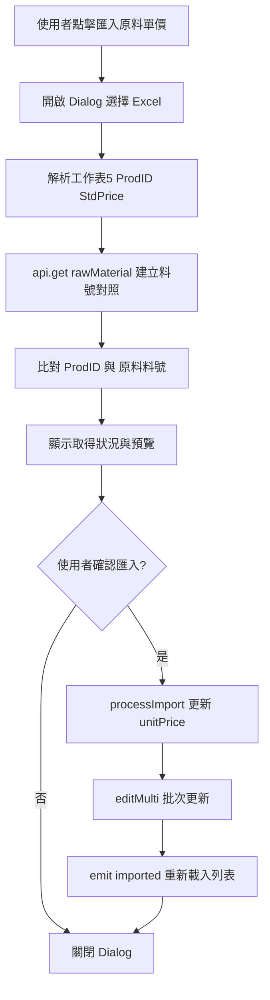

# 匯入原料單價功能

## 需求摘要

- 新增「匯入原料單價」功能，置於原料 toolbar（與匯入成分組成並列）。
- 資料來源：Excel 檔案（見下方說明），使用 **工作表5**。
- 比對邏輯：工作表5 的 **ProdID** 對應原料的 **原料料號**（`materialNumber`），取得 **StdPrice** 寫入原料的 **單價**（`unitPrice`）。
- 流程：先顯示比對／取得狀況 → 使用者確認後再更新資料庫。

## 資料來源與檔案選擇

你提到的路徑為 `/Users/cuochung/Documents/美光科技/研發/眼霜.xlsx`。前端為瀏覽器環境，**無法直接讀取本機絕對路徑**，因此沿用「匯入成分組成」做法：**由使用者透過 `<v-file-input>` 選擇 Excel 檔案**。該路徑可視為「建議使用的檔案」；若日後需固定讀取某一路徑，須由後端提供讀取該路徑的 API。

---

## 實作架構



---

## 1. 新增元件 `importUnitPrice.vue`

**位置**：[`src/views/main/RawMaterial/importUnitPrice.vue`](src/views/main/RawMaterial/importUnitPrice.vue)（新建）

**參考**：沿用 [`importCostComposition.vue`](src/views/main/RawMaterial/importCostComposition.vue) 的結構與流程，差異在於讀取欄位、比對邏輯與更新欄位。

**主要結構**：

- **Dialog**：標題「匯入原料單價 Excel」。
- **檔案選擇**：`<v-file-input>` 接受 `.xlsx` / `.xls`，選擇後觸發解析。
- **Excel 解析**：
  - 使用 `XLSX` 讀取 workbook。
  - 目標工作表：**`工作表5`**（`workbook.SheetNames` 依名稱查找）；若實務上為 `Sheet5`，可再加 fallback。
  - 第一行當標題，建立欄位映射。必要欄位：**ProdID**、**StdPrice**。
  - 逐行讀取，產出 `{ prodId, stdPrice }[]`（可 trim、略過空行）。
- **比對與狀態**：
  - `api.get('rawMaterial')` 取得全部原料，建立 `Map<materialNumber, { snkey, ...datalist }>`。
  - 對每筆 Excel 列：`ProdID` 對應 `materialNumber`，若存在則標記 `exists: true` 並保留 `existingData`、`stdPrice`。
  - 若同一 ProdID 多筆，可約定取第一筆 StdPrice。
- **顯示取得狀況**（對應你「先顯示取得的狀況」）：
  - **統計區**：總筆數、可更新數（存在且有 StdPrice）、料號不存在數、無 StdPrice 跳過數。
  - **預覽表格**：原料料號（ProdID）、狀態（存在 / 不存在）、StdPrice、資料庫中的原料名稱等；可視需要支援展開/收合。
- **動作按鈕**：「取消」、「確認匯入（N 個原料）」；僅當存在可更新筆數時啟用確認匯入。
- **processImport**：
  - 過濾 `exists && stdPrice != null && stdPrice !== ''` 的項目。
  - 對每筆：`updatedData = { ...existingData, unitPrice: stdPrice }`，並更新 `editInfo`（unshift 一筆 `{ snkey, name, time }`）。
  - `updatePayload = [{ snkey, materialNumber, datalist: JSON.stringify(updatedData) }, ...]`。
  - 呼叫 `api.options(\`general/editMulti/${store.state.databaseName}/rawMaterial\`, updatePayload)`。
  - 成功後 `emit('imported')`、關閉 dialog；失敗則以 `$swal` 顯示錯誤。

**技術要點**：

- 使用 `store.state.databaseName`、`store.state.pData`（snkey、username）、`dayjs`、`api`、`XLSX`，與 [`importCostComposition.vue`](src/views/main/RawMaterial/importCostComposition.vue) 一致。
- StdPrice 若為 Excel 數值格式，可 `parseFloat` 後再轉字串寫入 `unitPrice`；若為空或非數字，該筆不加入更新名單。

---

## 2. 在 Toolbar 加入按鈕並掛載元件

**檔案**：[`src/views/main/RawMaterial/index.vue`](src/views/main/RawMaterial/index.vue)

- 在 `raw-material-toolbar` 的 `button-group` 內，於「匯入成分組成」按鈕旁新增「匯入原料單價」按鈕（同一 `toolbar-btn` 結構）。
- 掛載 `importUnitPrice` 元件，監聽 `@imported`，觸發 `getAllData()` 重新取得原料列表。

可參考目前結構（約 78–90 行）：

```vue
<importRawMaterial class="toolbar-btn" @getAllData="getAllData"></importRawMaterial>
<importCostComposition class="toolbar-btn" @imported="getAllData"></importCostComposition>
<!-- 新增 -->
<importUnitPrice class="toolbar-btn" @imported="getAllData"></importUnitPrice>
<popupadd ... />
```

按鈕樣式可與「匯入成分組成」相同（例如 `color="success"`、`variant="elevated"`、`rounded="pill"`、`prepend-icon="mdi-file-excel"` 等），僅文字改為「匯入原料單價」。

---

## 3. 流程與「匯入成分組成」的對照

| 步驟 | 匯入成分組成 | 匯入原料單價 |

|------|--------------|--------------|

| 觸發 | 按鈕 → Dialog | 按鈕 → Dialog |

| 檔案 | 使用者選檔 | 使用者選檔 |

| 工作表 | 成分組成 | **工作表5** |

| 關鍵欄位 | 原料料號、Composition、wt% 等 | **ProdID**、**StdPrice** |

| 比對 | 原料料號 vs 原料資料庫 | **ProdID** vs **原料料號** |

| 預覽 | 存在/不存在、Composition 數量 | 存在/不存在、StdPrice、可更新數 |

| 更新 | `editMulti` 更新 `compositions` | `editMulti` 更新 **`unitPrice`** |

| API | `editMulti` rawMaterial | 同 `editMulti` rawMaterial |

---

## 4. 錯誤與邊界處理

- 找不到 **工作表5**（及 fallback **Sheet5**）：顯示明確錯誤，列出 `workbook.SheetNames`。
- 缺少 **ProdID** 或 **StdPrice** 欄位：解析時檢查標題列，缺少則提示並中止。
- **ProdID 為空**：該列跳過，不參與比對與更新。
- **StdPrice 為空或非數字**：該列僅顯示在預覽，不加入更新 payload；統計區可標示「無單價跳過」筆數。
- **editMulti 部分失敗**：若 API 回傳 `state === 0` 等錯誤，以 `$swal` 提示並列出失敗筆數，不關閉 dialog 以便使用者重試或調整檔案。

---

## 5. 檔案與依賴

- **新增**：`src/views/main/RawMaterial/importUnitPrice.vue`
- **修改**：`src/views/main/RawMaterial/index.vue`（引入 `importUnitPrice`、toolbar 按鈕與 `@imported`）
- **依賴**：現有 `XLSX`、`api`、`useStore`、`dayjs`、`$swal`，無須新增套件。

---

## 6. 後續可選調整

- 若實際 Excel 工作表名稱為 **Sheet5** 等，在解析時加入 fallback 邏輯。
- 若需支援「建議檔案路徑」提示，可在 dialog 內加一行說明文字，例如：「建議使用 眼霜.xlsx，並確保含有工作表5 與 ProdID、StdPrice 欄位。」
- 若希望匯入前可手動勾選/取消部分原料再更新，可在預覽表格加 checkbox，僅對勾選項目做 `editMulti`。

以上為「匯入原料單價」的實作計畫；完成後，使用者可從 toolbar 操作，先看到比對與取得狀況，再決定是否寫入資料庫單價。