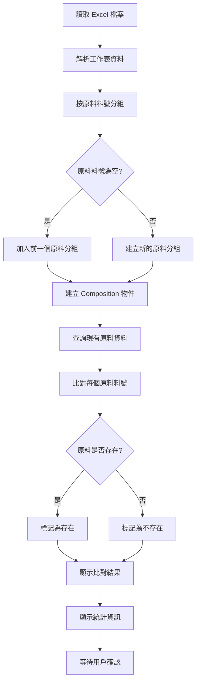

# 成分組成匯入功能調整計劃

## 需求分析

根據用戶需求：

1. Excel 中「原料料號」和「項次」都有值時，代表需要透過「原料料號」與原料資料比對
2. 當「原料料號」為空但「項次」有值時，表示該行屬於前一個「原料料號」的額外 Composition
3. 例如：SC30001 項次 1 → 記錄 1 個 Composition；SC30005 項次 1～2 → 記錄 2 個 Composition
4. 記錄時採用物件的方式，以便未來擴展
5. 如果原料已存在，完全替換現有原料資料的 compositions 陣列
6. 沒有項次資料的 就乎略

## 實作方案（第一階段：顯示比對結果）

### 1. 修改 Excel 解析邏輯 (`src/views/main/RawMaterial/importCostComposition.vue`)

#### 1.1 調整資料分組邏輯

- 在 `parseExcelFile` 函數中，修改資料轉換邏輯：
  - 遍歷所有資料行
  - 當遇到「原料料號」有值時，開始一個新的原料分組
  - 當「原料料號」為空但「項次」有值時，將該行資料加入前一個原料分組
  - 建立一個 Map 結構：`{ materialNumber: [composition1, composition2, ...] }`
  - 處理第一行「原料料號」為空的情況（顯示錯誤）

#### 1.2 Composition 物件結構

每個 Composition 物件包含以下欄位：

```javascript
{
  itemNumber: '項次',
  composition: 'Composition',
  wtPercent: 'wt%',
}
```

### 2. 查詢現有原料資料並比對

#### 2.1 查詢現有原料資料

- 在檔案選擇後，自動查詢所有原料資料
- 建立「原料料號」到原料資料的映射表：`{ materialNumber: { snkey, ...原料資料 } }`

#### 2.2 比對邏輯

- 對於每個從 Excel 解析出的「原料料號」：
  - 檢查是否存在於原料資料庫中
  - 標記狀態：`exists`（存在）或 `notFound`（不存在）
  - 統計每個原料的 Composition 數量

### 3. 比對結果顯示

#### 3.1 修改資料預覽顯示

- 調整預覽表格，顯示分組後的資料結構
- 顯示欄位：
  - **原料料號**：從 Excel 解析出的原料料號
  - **狀態**：顯示「存在」或「不存在」（用不同顏色標示）
  - **Composition 數量**：該原料有多少個 Composition
  - **Composition 預覽**：顯示前幾個 Composition 的名稱（可展開查看全部）
  - **現有原料名稱**：如果原料存在，顯示原料資料庫中的原料名稱

#### 3.2 詳細資訊顯示

- 點擊展開可查看該原料的所有 Composition 詳細資訊
- 顯示每個 Composition 的完整資料（項次、Composition、wt% 等）

#### 3.3 統計資訊

- 顯示統計資訊：
  - 總共解析出多少個原料
  - 其中多少個原料存在於資料庫中
  - 其中多少個原料不存在於資料庫中
  - 總共多少個 Composition

### 4. 錯誤處理

#### 4.1 驗證邏輯

- 檢查「原料料號」是否為空但「項次」有值的情況（需要前一個「原料料號」存在）
- 檢查第一行「原料料號」是否為空（顯示錯誤）
- 驗證每個 Composition 的必要欄位

#### 4.2 錯誤訊息

- 提供清楚的錯誤訊息，指出哪些「原料料號」在資料庫中不存在
- 顯示哪些 Composition 資料有問題
- 標示哪些原料需要先建立基本資料

### 5. 暫時不執行資料庫更新

- 移除或隱藏「確認匯入」按鈕（如果存在）
- 僅顯示比對結果，不執行任何資料庫寫入操作
- 保留比對結果資料，供未來實作更新功能時使用

## 待確認事項

1. **Composition 儲存欄位名稱**：用戶選擇了「選項B：其他方式」，需要確認具體的儲存結構

   - 建議：在原料的 `datalist` JSON 中新增 `compositions` 陣列欄位
   - 或者：使用其他欄位名稱（如 `costCompositions`、`ingredientCompositions` 等）

2. **原料不存在時的處理**：

   - 如果 Excel 中的「原料料號」在資料庫中不存在，應該如何處理？
   - 選項A：跳過該原料，僅顯示警告訊息
   - 選項B：自動建立基本原料資料（需要定義預設值）
   - 選項C：要求用戶先匯入原料基本資料

3. **資料合併策略**：

   - 如果原料已存在且有 `compositions` 資料，是否完全替換？
   - 用戶已選擇「完全替換」，但需要確認是否要保留其他欄位（如 createInfo、editInfo 等）

## 檔案修改清單

1. `src/views/main/RawMaterial/importCostComposition.vue`

   - 修改 `parseExcelFile` 函數：實現資料分組邏輯
   - 新增 `queryExistingMaterials` 函數：查詢現有原料資料
   - 新增 `compareMaterials` 函數：比對 Excel 資料與現有原料資料
   - 修改資料預覽顯示：顯示分組後的結構和比對結果
   - 新增統計資訊顯示
   - 暫時不實作資料庫更新邏輯（第二階段）

## 資料流程圖



## 注意事項

1. 確保「原料料號」為空時，前一個「原料料號」必須存在
2. 處理 Excel 中可能出現的異常情況（如第一行「原料料號」為空）
3. 確保 Composition 物件的結構一致，便於未來擴展
4. **第一階段僅顯示比對結果，不執行任何資料庫寫入操作**
5. 比對結果資料結構需保留，供未來實作更新功能時使用

## 第二階段（未來實作）

待用戶確認比對結果後，再實作：

- 資料庫更新邏輯
- 「確認匯入」按鈕功能
- 更新/新增原料資料的實際操作