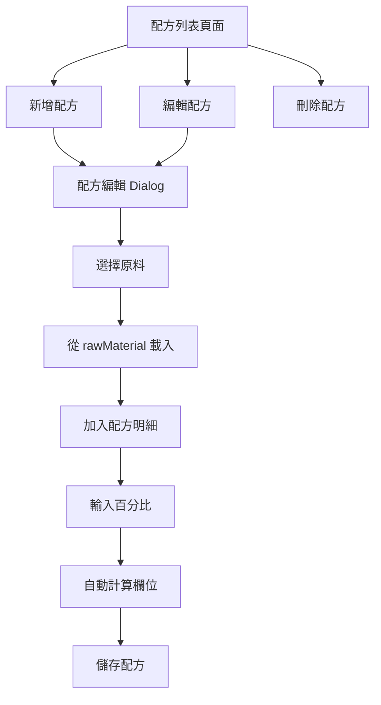

# 配方表建構功能

## 需求摘要

建立配方管理系統，參考 Excel 格式（`/Users/cuochung/Documents/美光科技/研發/眼霜.xlsx` 的「配方」工作表），實現以下功能：

- 配方列表管理（查看、搜尋、新增、編輯、刪除）
- 從原料資料庫（rawMaterial）選擇原料加入配方
- 百分比手動輸入，其他欄位（quprs, TTprs, 廠值, 實驗）自動計算
- 配方版本管理（手動輸入）
- 備註欄位
- 原料單價在加入配方時固定，不隨原料資料庫更新

## 資料結構設計

### 資料表：`recipe`

使用單表結構，所有資料存儲在 `datalist` JSON 欄位中：

```json
{
  "recipeNumber": "FQ23015",
  "productName": "眼霜",
  "productSpec": "1000",
  "combinationQuantity": 1,
  "productionBatch": 1000,
  "experimentBatch": 200,
  "totalProduction": 1000,
  "unitCost": "304.20",
  "version": "v1.0",
  "notes": "備註文字",
  "items": [
    {
      "sequence": 1,
      "itemNumber": "A-1(50)",
      "materialNumber": "SC30001",
      "materialName": "1.3-BG",
      "percentage": "2.00",
      "quprs": 145,
      "ttprs": 2.9000,
      "factoryValue": 20,
      "experimentValue": 4.0000,
      "supplier": "亨元"
    }
  ],
  "createInfo": {
    "snkey": "1",
    "name": "系統管理員",
    "time": "2025-01-21 10:00:00"
  },
  "editInfo": []
}
```

**欄位說明**：

- `recipeNumber`: 配方編號（唯一識別，類似 customerNumber）
- `productName`: 產品名稱
- `productSpec`: 產品規格
- `combinationQuantity`: 組合數量（預設 1）
- `productionBatch`: 生產批量（預設 1000）
- `experimentBatch`: 實驗批量（預設 200）
- `totalProduction`: 總生產量（自動計算：combinationQuantity × productionBatch）
- `unitCost`: 單位成本（自動計算：總成本 / totalProduction）
- `version`: 配方版本（手動輸入）
- `notes`: 備註
- `items`: 配方明細陣列

**配方明細欄位**：

- `sequence`: 序號（1, 2, 3...）
- `itemNumber`: 項次（如 A-1, A-2, B, C, D）
- `materialNumber`: 原料料號（關聯 rawMaterial）
- `materialName`: 原料名稱（從 rawMaterial 帶入）
- `percentage`: 百分比（手動輸入，如 "2.00"）
- `quprs`: 原料單價（自動：rawMaterial.unitPrice × 1000，加入時固定）
- `ttprs`: 總價（自動：quprs × factoryValue / 1000）
- `factoryValue`: 廠值（自動：productionBatch × percentage / 100）
- `experimentValue`: 實驗（自動：experimentBatch × percentage / 100）
- `supplier`: 廠商（從 rawMaterial.supplier 帶入）

## 實作架構



## 檔案結構

### 1. 新增路由

**檔案**：`src/router/index.js`

在 `children` 陣列中新增：

```javascript
{ path: 'Recipe', name: 'Recipe', component: () => import('@/views/main/Recipe/index.vue') }
```

### 2. 配方列表頁面

**檔案**：`src/views/main/Recipe/index.vue`（新建）

**功能**：

- 顯示配方列表（配方編號、產品名稱、版本、建立時間等）
- 搜尋功能（支援配方編號、產品名稱）
- 新增、編輯、刪除按鈕
- 統計資訊（配方總數、總成本等）

**參考**：`src/views/main/RawMaterial/index.vue` 的結構與樣式

**主要欄位顯示**：

- 配方編號
- 產品名稱
- 版本
- 總成本
- 單位成本
- 原料數量
- 建立資訊
- 修改資訊

### 3. 配方編輯元件

**檔案**：`src/views/main/Recipe/Add.vue`（新建）

**功能**：

- Dialog 形式的編輯介面
- 基本資訊區：產品名稱、配方編號、產品規格、組合數量、生產批量、實驗批量、版本、備註
- 配方表區：
  - 表格顯示配方明細
  - 從原料資料庫選擇原料（使用 v-autocomplete 或彈出視窗）
  - 支援新增、刪除、排序配方項目
  - 百分比可編輯，其他欄位自動計算
  - 底部顯示小計（總百分比、總成本）

**